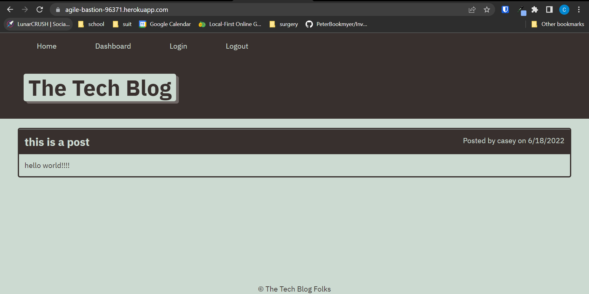

# Module 14, Model-View-Controller (MVC) Challenge: Tech Blog

  ## Description
  
  This is a tech blog for module 14 due on 6/18/2022. This code was provided for us.
  
  ## License
  
  Developed under Mit License 
  
  ## Table of Contents
  
  - [Description](#description)
  - [Deployed@](#deployed@)
  - [Usage](#usage)
  - [Contributing](#contributing)
  - [License](#license)
  - [Test Instructions](#tests)
  
  ## Deployed@

  To see a deployed version of this app visit:
  https://agile-bastion-96371.herokuapp.com/

  ## Usage
  
  This can be used to post text blogs about tech.
  
  ## Screenshot
  
  
  
  ## Contributing
  
  To contribute send an email to the address below
  
  ## Tests
  
  Visit the deployed page and check operation of application.
  
  ---
  
  ## My GitHub
  
  [CaseySMiller](https://github.com/CaseySMiller)
  
  ## Email me
  
  [caseysmiller@yahoo.com](mailto:caseysmiller@yahoo.com)

